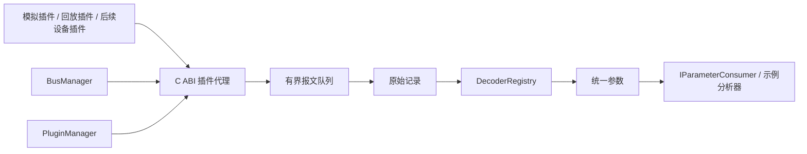

# 后端架构与审阅入口

当前为 v0.2。在原有总线插件和原始报文管线上，新增配置化解码、显式时间映射、质量处理、一致性和指令响应分析。详细语义见 [参数与关联设计](processing-v0.2.md)。无配置模式保留初版的模拟温度示例。

后续多协议接入的抽象类与自动/手动选择契约见[协议扩展抽象接口](protocol-abstractions.md)，其具体实现、路由与命令行入口见[协议运行时](protocol-runtime.md)。协议运行时作为可选解码器接入现有 `IParameterDecoder` 位置，默认运行程序仍使用按协议编号分派的 `DecoderRegistry`。

## 模块结构

| 对象 | 位置 | 责任 |
|---|---|---|
| `BusManager` | `include/core/bus_manager.hpp` | 每实例管理锁、配置、启停、代次、替换回退 |
| `PluginManager` | `include/core/plugin_manager.hpp` | 规范化插件路径、ABI 校验、模块共享与弱引用缓存 |
| `CPluginAdapter` | `src/plugin/plugin_manager.cpp` | 将 C 接口适配到 `IBusAdapter`；复制借用载荷 |
| `SharedLibrary` | `src/platform/shared_library.cpp` | Windows/POSIX 动态库加载实现 |
| `FramePipeline` | `include/core/frame_pipeline.hpp` | 有界队列、顺序记录和处理、按来源排空、故障状态 |
| `ArchiveWriter/Reader` | `include/core/archive.hpp` | 小端编码、CRC32、长度及截断检查 |
| `DecoderRegistry` | `include/core/decoder_registry.hpp` | 按协议编号分派，核心无需增添总线 switch 分支 |
| `SimulatedDecoder` | `src/decoder/simulated_decoder.cpp` | 示例载荷到工程量的转换 |
| `RuleAnalyzer` | `src/analysis/rule_analyzer.cpp` | 有限内存历史、阈值事件和证据索引 |
| `BackendConfiguration` | `include/core/configuration.hpp` | 严格加载本项目 INI 字典与时钟、规则配置 |
| `DictionaryDecoder` | `src/decoder/dictionary_decoder.cpp` | 按位提取、编码与缩放、类型和有效性转换 |
| `BuiltinProtocolFactory` | `src/protocol/protocols.cpp` | 内置协议描述、探测器与解析器的创建 |
| `ProtocolRouter` | `src/protocol/protocol_router.cpp` | 自动/手动选择、观察与候选预算、按地址/代次隔离、重置与移除 |
| `DictionaryMessageDecoder` | `src/protocol/protocol_pipeline.cpp` | 已校验协议消息到工程参数的字典映射 |
| `ProtocolPipelineDecoder` | `src/protocol/protocol_pipeline.cpp` | 组合路由器与消息解码器，接入 `IParameterDecoder` |
| `bus_protocol` | `src/protocol/protocol_main.cpp` | 命令行协议识别与路由检查 |
| `TimeQualityProcessor` | `include/core/processing.hpp` | 显式偏移映射、误差界、序号与时间质量 |
| `ProcessingService` | `src/analysis/processing.cpp` | 有限窗口一致性、指令响应与多源融合分析，重排、去重、规则状态和水位 |
| `JsonlAnalysisSink` | `src/storage/jsonl_analysis.cpp` | 参数与带证据引用的分析结果持久化 |

## 对象生命周期

1. `add` 加载模块，校验 ABI，创建并配置适配器。相同 ID 不允许重复。
2. `start` 分配新的实例代次，再启动工作线程。
3. 采集回调将报文复制进宿主对象。插件的临时缓冲区不被后端持有。
4. `stop` 等待插件线程和回调结束，再按该来源已入队的数量等待处理完成。
5. `remove` 销毁适配器。适配器持有模块的强引用，最后一个强引用释放时才能关闭动态库。

管理操作使用每实例互斥量。某实例等待停止和排空时，不持有全局实例表锁。其他实例的采集回调可继续入队。析构 `BusManager` 前，调用方应先结束外部管理线程；析构先停止采集，然后上层关闭处理链路。

## 热替换与失败行为

| 情况 | 行为 |
|---|---|
| 库不存在、ABI 不兼容、配置无效 | 保留原实例运行，不进入停止流程 |
| 新实例启动成功 | 使用新实例，销毁已停止的旧实例 |
| 新实例启动失败 | 停止新实例并排空，然后尝试重启旧实例；向调用方返回失败及恢复结果 |
| 旧实例也无法恢复 | 返回替换和恢复两项错误，实例保持可查询故障状态 |
| 队列无法排空或处理链路故障 | 不继续切换，返回失败，旧实例保持停止 |
| 原实例未运行 | 替换为已配置的新实例，等待显式 start |

每次启动使用新代次；旧实例恢复也使用新代次，避免序号重置被误认为同一连续采集段。当前没有持久化启停事件日志，采集空档通过代次和时间戳区分，后续应增加完整的生命周期事件记录。

同一个物理设备可能不允许两个句柄同时打开。真实插件应在 configure 阶段仅校验参数，在 start 阶段获取独占设备资源，stop 阶段释放，以便执行替换流程。

## 数据与时间

`RawFrame` 保存宿主来源、实例代次、协议、通道、原采集时间、宿主接收时间、时钟域、序号、记录编号、来源溯源和载荷。记录编号在一个输出归档内唯一；跨归档引用需要同时保留文件/会话标识。

`ParameterSample` 使用 variant 保存类型化数值，带单位、有效性和解码版本。默认模拟解码只产生 double；配置字典支持整数、浮点、布尔与枚举。尚无真实飞机参数映射。未知协议或没有匹配来源/通道的报文仍被原始记录，解码统计为 unsupported。

回放参数来源为 `回放实例/原来源`，并带原始代次。分析器同时检查新会话代次与原始代次，避免跨原始重启边界产生阈值事件。

模拟插件使用宿主单调时钟；这不建立任何真实设备的公共时基。回放插件按宿主接收间隔调度，源采集时间保留且标记为 recorded。v0.2 离线分析直接处理原始归档，并复用配置模式的字典和分析对象。已提供显式偏移/误差映射、有限时间窗口及新鲜度检查、带最大迟到窗口的重排缓冲和按窗口的冗余去重；插值和自动时钟同步尚未实现。

## 运行与资源边界

首版使用单进程验证插件所有权和端到端流程，尚未拆成采集/处理两个进程。处理线程顺序执行记录、解码和消费；慢分析会填满队列。默认队列容量 4096 条，每条载荷上限 64 KiB，不能据此宣称实时或无丢失性能。

参数和事件历史默认各保留 1024 条；统计与规则状态按来源积累，长期动态创建新来源时需要后续增加会话清理/归档策略。管理停止等待处理的超时为 5 秒。插件 stop 本身必须可靠结束；宿主不强杀仍在执行插件代码的线程。

配置模式的参数与事件已经写入 JSONL，字典加载与两类关联规则可用。下一阶段可按实际需求选择设备 SDK/ICD 对接、带迟到窗口的重排、平台 API、数据库或双进程隔离；硬件与时钟选择应先获得真实接口资料。
