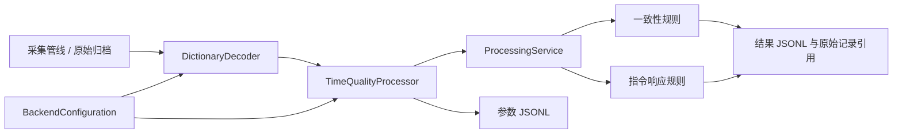

# v0.2 参数字典、时间质量与关联分析

## 处理结构



全部生产代码采用 C++20。`DictionaryDecoder` 实现既有 `IParameterDecoder`，`ProcessingService` 实现既有 `IParameterConsumer`，动态插件 ABI 与原始归档格式保持 v1 兼容。无配置运行模式保留 v0.1 行为。

## 参数字典

示例位于 `config/correlation-demo.ini`。这是项目定义的 schema 1 文本格式，支持整行 `#`/`;` 注释和 UTF-8；键值用 `=` 分隔，首尾空白去除，没有字符串转义或行末注释。重复节、重复键、未知键、缺失字段、非有限数字和越界配置均拒绝。

`[dictionary]` 包含 `schema=1` 和明确的 `version`。每个 `[parameter <id>]` 定义一个参数：

| 字段 | 含义 |
|---|---|
| source / protocol / channel | 精确匹配原始来源、协议编号和通道；source 可为 `*` |
| bit_offset / bit_width | 起始位与宽度，宽度 1..64 |
| byte_order | little 或 big，同时决定本格式中的位编号约定 |
| type | signed、unsigned、float64、bool、enum |
| scale / offset | 工程量转换，默认 1 和 0；有转换时结果为 double |
| unit | 单位；一致性规则要求两侧单位字符串相同 |
| max_age_ms | 配对和边沿基线的最大可用年龄，正整数毫秒 |
| sequence_step | 可选，默认 0 禁用连续性检查；非零时要求相邻该参数样本的序号按指定步长递增 |
| valid_bit | 可选有效位；1 表示有效，0 表示无效 |
| enum_values | enum 专用，例 `0:OFF,1:ON`；未定义的编码标记无效 |

little 使用每字节 LSB0 编号，字段第一个位为数值最低位；big 使用每字节 MSB0 编号，字段第一个位为数值最高位。这不是默认兼容所有 DBC 的 Motorola 位编号，需要转录时显式核对。float64 仅支持字节对齐的 IEEE 754 64 位编码；bool 宽度必须为 1，enum 宽度为 1..63。BNR/BCD、复杂复用字段及应用报文重组尚未提供专用解释器。

未缩放的 64 位整数保持整数类型；分析规则为避免 double 精度误判，拒绝把绝对值超过 2^53 的整数用于数值比较，但仍完整输出原始整数。短载荷、无效状态位、未知枚举和非有限结果会产生无效参数记录，不会被当作正常的零值。

字典匹配原始 `source`。离线 `bus_analyze` 直接读取原始归档，因此保持来源、记录编号、代次与时间。旧版回放插件输出的新会话与 recorded 时钟域没有被自动当作真实公共时间；分析旧记录优先使用离线命令，而不是用回放到达时间估计响应延迟。

## 时间和质量

每个 `[clock <source>]` 定义 `domain`、`group`、`offset_ns` 和 `uncertainty_ns`：

```text
共同时间 = 原始 capture_time_ns + 已知 offset_ns
```

同一个 group 声明这些来源已经具有可比较时基；这需要硬件同步、标定或明确的模拟时钟事实支持。软件不自动估计偏差或漂移，不把“配置了同名 group”当作同步证据。示例全部来自同一个已知模拟时钟，所以 offset 和 uncertainty 为 0。

程序检查时间运算上溢/下溢，保留原采集时间、宿主接收时间、公共时间和误差范围。未映射时钟不参与关联。重复序号、乱序、配置启用后发现的序号缺口会标出质量原因。序号步长必须与该参数实际报文调度一致，不能盲目对所有真实总线设为 1；序号回绕当前也会被视为间断。

处理水位按 group 单调推进，无效样本不能推动水位或诱发其他规则的超时。配置 `[reorder <group>]` 的 `window_ms` 后，同一时间组的样本先按映射时间进入有界重排缓冲，等 `最大时间 − window` 之后再按时间顺序做质量检查和水位推进，因此同组内微小的到达乱序不再被标为 `late_for_group`；未配置该组的地址行为不变，超出窗口的旧样本仍标记 `late_for_group` 且不参与关联。缓冲在 `finish()` 时全部按时间顺序释放。

`[dedup <id>]` 配置 `source`、`parameter` 和 `window_ms`，对匹配样本按时间窗去重：首个样本正常处理，窗口内再次到达的样本保留记录并标记 `duplicate`，不参与关联，也不更新去重基准。这样同一参数经冗余通道重复上报时只分析一次，同时保留原始记录可追溯。

过期是“相对于比较时刻”的判断，按 `年龄 + 时间不确定度 <= max_age` 检查。JSONL 的 usable 表示该条样本到达时通过质量处理，不表示它将来永不过期。

## 一致性规则

`[consistency <id>]` 选择左右两个 source/parameter，配置 `tolerance` 和 `window_ms`。

规则保留每侧最近样本，要求同一时间组、单位相同、样本新鲜，且两侧时间差加两侧误差界之和不超过匹配窗口。没有插值。满足条件后输出 `consistent` 或 `inconsistent`；metric 是左值减右值，单位与输入一致。单位不匹配输出 `unit_mismatch`；不适于数值比较的值输出 `non_numeric_pair`。时间组不同、过期或窗口外数据不会产生匹配结果。

这是两路测量的一致性比较，不是加权融合或独立性证明。两路若来自同一个传感器转发，需要在配置与后续拓扑信息中识别，不能据此增加置信度。

## 指令—响应规则

`[response <id>]` 选择 command 和 response 两个 source/parameter，分别配置上升沿阈值和 `max_delay_ms`。上升沿要求同一代次里存在新鲜的阈值下方样本，然后越过阈值。它描述参数观测的先后，不证明物理因果关系。

| outcome | 含义 |
|---|---|
| response_observed | 在窗口内观察到响应上升沿；metric 为毫秒，另附延迟上下界 |
| response_time_ambiguous | 误差范围跨过先后顺序或最大响应时间边界，不能明确归类 |
| response_timeout | 已观察到时间窗口结束，并有足够新鲜的响应观测，但窗口内未观察到所定义上升沿 |
| response_observation_gap | 窗口结束时响应观测已过期或不足，不推断执行机构故障 |
| response_missing_baseline | 指令上升时没有新鲜的响应基线 |
| response_already_high | 指令出现前，响应参数已高于阈值 |
| response_cancelled | 参与来源代次、字典版本或数据质量发生中断，旧关联取消 |
| response_superseded | 新指令边沿替代尚未完成的指令 |
| response_unresolved | 输入记录结束或会话结束时窗口尚无充分结论 |

误差界按两侧 uncertainty 之和传播。恰在截止时刻到达的响应先处理；超时判定还等待配置的时间误差界，避免过早下结论。

规则水位由有用的时间观测推进。全部数据停止时，软件不会把电脑等待时长自动当作设备时间；调用方可通过 C++ `advance(group, watermark_ns)` 提供已验证的时间水位。没有新的观测或显式水位时，待定窗口保持待定，结束时归类 unresolved。

任何一侧热替换、重新启动或字典版本改变都会重建关联基线，避免跨采集空档拼出响应。v0.2 字典在分析会话启动时加载，尚未提供配置热重载 API。

## 输出和追溯

- `parameters.jsonl`：类型化数值、单位、来源、代次、序号、原始记录编号、字典版本、时间、质量标记。
- `events.jsonl`：规则、结果、时间组、指标、可选延迟界，以及参与判断的原始记录引用。
- `configuration.ini`：实际配置的副本。
- 离线额外保存 `input_archive.txt` 和 `summary.json`；summary 只有成功完成才生成。

记录编号在一个原始归档内有效，必须结合本次输入文件识别。JSONL 中 64 位整数和纳秒时间是 JSON 数字；平台使用 JavaScript 时，应选择支持大整数的 JSON 解析策略，避免超过 2^53 后失真。原始文件与结果不自动覆盖。写入/刷新失败会抛出错误；实时处理管线随后进入故障状态。

当前没有数据库、HTTP/gRPC 服务、硬件自动同步、长期统计模型或通用飞行故障诊断。主要交付是可以测试、回放、配置和接入后续平台接口的后端对象与数据格式。
